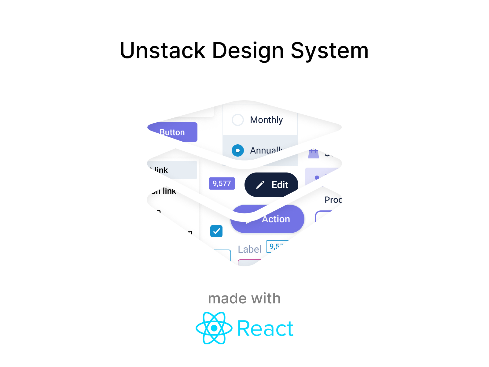

# Unstack Design System



## Contents

- [Development](#development)
- [Contributing](#contributing)
- [Resources](#resources)
- [License](#license)

## Development

Prerequisites: A working installation of [npm](https://nodejs.org/en/download/).

```bash
# install packages
npm i

# run storybook
npm run storybook

# build storybook
npm run build-storybook
```

## Contributing

This project uses [Conventional Commits](https://www.conventionalcommits.org/en/v1.0.0/), [Semantic Versioning](https://semver.org/), and [Semantic Release](https://semantic-release.gitbook.io/semantic-release/) to manage package publishing. We ask all who are unfamiliar with those specs to read up on them before creating a pull request. Otherwise all contributions are welcome!

## Resources

- [Unstack Design System docs](https://unstack.gitbook.io/unds/)
- [Storybook docs](https://storybook.js.org/docs/react/get-started/introduction)
- [Reach UI docs](https://reach.tech/)
- [Theme UI docs](https://theme-ui.com/getting-started)
- [Emotion docs](https://emotion.sh/docs/introduction)
- [React Spring docs](https://react-spring.io/basics)

## License

Unstack Design System is licensed under the [GPU 3.0 License](LICENSE).
